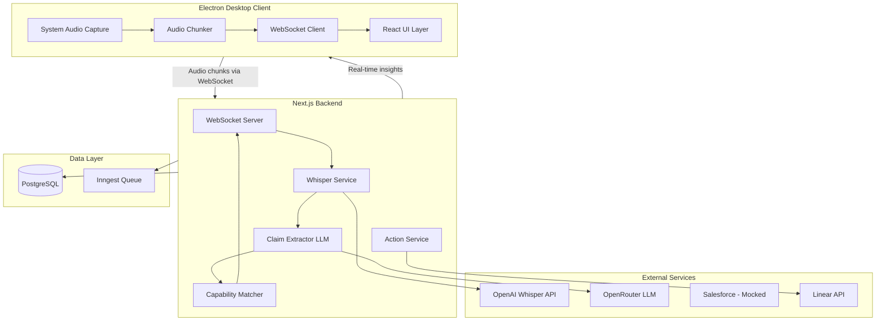
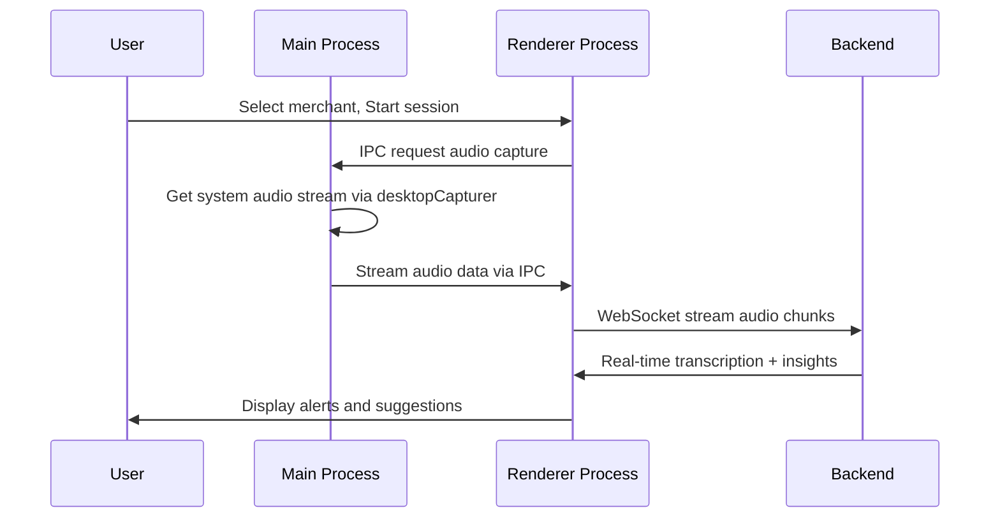

# Nexus Real-Time Copilot Implementation Plan

## 1. System Architecture Overview



The system follows a **streaming pipeline architecture**:

1. Audio captured client-side, chunked and streamed to backend
2. Backend transcribes via Whisper API in real-time
3. LLM extracts structured claims from transcript
4. Claims compared against capability database
5. Insights streamed back to client instantly

---

## 2. Client (Electron) Design

### Responsibilities

- **System audio capture** using Electron's `desktopCapturer` API
- **Audio chunking** into 5-10 second segments for streaming
- **WebSocket connection** to backend for bi-directional communication
- **UI rendering** for merchant selection, live transcript, alerts, and actions

### Key Files to Modify/Create

| File | Purpose |

|------|---------|

| [`apps/desktop/main.js`](apps/desktop/main.js) | Add audio capture permissions, IPC handlers |

| `apps/desktop/src/audio/capture.ts` | System audio capture logic |

| `apps/desktop/src/audio/chunker.ts` | Audio segmentation for streaming |

| `apps/desktop/src/services/websocket.ts` | WebSocket client with reconnection |

| `apps/desktop/src/components/` | React components for UI |

### Audio Capture Flow



### Migration to React

The current vanilla HTML/JS renderer should be migrated to React for component-based UI. Use Vite as the bundler for the renderer process.

---

## 3. Backend Design

### Responsibilities

- **WebSocket server** for real-time audio streaming and response delivery
- **Whisper integration** for speech-to-text
- **Claim extraction** via LLM (OpenRouter)
- **Capability matching** against internal database
- **Action orchestration** (Linear tickets, future Salesforce)

### Directory Structure

```
apps/web/src/
├── core/
│   ├── db/
│   │   └── schema.ts          # Extended with new tables
│   ├── events/
│   │   ├── transcription.ts   # Inngest event handlers
│   │   └── claims.ts
│   ├── services/
│   │   ├── whisper.ts         # OpenAI Whisper client
│   │   ├── claims.ts          # LLM claim extraction
│   │   ├── capabilities.ts    # Capability matching logic
│   │   └── linear.ts          # Linear API client
│   └── domain/
│       ├── types.ts           # Shared type definitions
│       └── prompts.ts         # LLM prompt templates
├── app/
│   └── api/
│       ├── sessions/
│       │   └── route.ts       # REST: Create/manage sessions
│       └── ws/
│           └── route.ts       # WebSocket endpoint
└── lib/
    ├── openrouter.ts          # Existing
    └── whisper.ts             # OpenAI Whisper client
```

### Key Services

**WhisperService** ([`apps/web/src/core/services/whisper.ts`](apps/web/src/core/services/whisper.ts))

- Accepts audio chunks (WAV/WebM format)
- Calls OpenAI Whisper API with `response_format: "verbose_json"` for timestamps
- Returns timestamped transcript segments

**ClaimExtractorService** ([`apps/web/src/core/services/claims.ts`](apps/web/src/core/services/claims.ts))

- Uses OpenRouter with structured output (JSON schema)
- Extracts: PSPs, countries, payment methods, dates, constraints, risks
- Maintains conversation context for coherent extraction

**CapabilityMatcherService** ([`apps/web/src/core/services/capabilities.ts`](apps/web/src/core/services/capabilities.ts))

- Queries existing `paymentProcessors` and `countryProcessorFeatures` tables
- Compares extracted claims against known capabilities
- Returns match status: SUPPORTED, UNSUPPORTED, PARTIAL, UNKNOWN

---

## 4. Data Models

### New Database Tables

```typescript
// apps/web/src/core/db/schema.ts - additions

export const merchants = pgTable("merchants", {
  id: text("id").primaryKey(),
  name: text("name").notNull(),
  salesforceId: text("salesforce_id"),
  stage: text("stage").notNull(), // PROSPECT | INTEGRATION | LIVE
  metadata: jsonb("metadata").default("{}"),
  createdAt: timestamp("created_at").defaultNow().notNull(),
  updatedAt: timestamp("updated_at").defaultNow().notNull(),
});

export const sessions = pgTable("sessions", {
  id: text("id").primaryKey(),
  merchantId: text("merchant_id").references(() => merchants.id),
  userId: text("user_id").notNull(),
  status: text("status").notNull(), // ACTIVE | ENDED
  startedAt: timestamp("started_at").defaultNow().notNull(),
  endedAt: timestamp("ended_at"),
});

export const transcriptSegments = pgTable("transcript_segments", {
  id: text("id").primaryKey(),
  sessionId: text("session_id").references(() => sessions.id).notNull(),
  startTime: real("start_time").notNull(), // seconds from session start
  endTime: real("end_time").notNull(),
  text: text("text").notNull(),
  confidence: real("confidence"),
  createdAt: timestamp("created_at").defaultNow().notNull(),
});

export const claims = pgTable("claims", {
  id: text("id").primaryKey(),
  sessionId: text("session_id").references(() => sessions.id).notNull(),
  segmentId: text("segment_id").references(() => transcriptSegments.id),
  type: text("type").notNull(), // PSP | COUNTRY | PAYMENT_METHOD | DATE | CONSTRAINT | RISK
  value: text("value").notNull(),
  context: text("context"), // surrounding transcript text
  confidence: real("confidence"),
  matchStatus: text("match_status"), // SUPPORTED | UNSUPPORTED | PARTIAL | UNKNOWN
  matchDetails: jsonb("match_details").default("{}"),
  createdAt: timestamp("created_at").defaultNow().notNull(),
});

export const alerts = pgTable("alerts", {
  id: text("id").primaryKey(),
  sessionId: text("session_id").references(() => sessions.id).notNull(),
  claimId: text("claim_id").references(() => claims.id),
  severity: text("severity").notNull(), // INFO | WARNING | CRITICAL
  title: text("title").notNull(),
  message: text("message").notNull(),
  dismissed: boolean("dismissed").default(false),
  createdAt: timestamp("created_at").defaultNow().notNull(),
});

export const actions = pgTable("actions", {
  id: text("id").primaryKey(),
  sessionId: text("session_id").references(() => sessions.id).notNull(),
  type: text("type").notNull(), // LINEAR_TICKET | SALESFORCE_UPDATE | NOTE
  status: text("status").notNull(), // PENDING | COMPLETED | FAILED
  payload: jsonb("payload").notNull(),
  result: jsonb("result"),
  createdAt: timestamp("created_at").defaultNow().notNull(),
});
```

### TypeScript Types

```typescript
// apps/web/src/core/domain/types.ts

export type ClaimType = 
  | "PSP" 
  | "COUNTRY" 
  | "PAYMENT_METHOD" 
  | "DATE" 
  | "CONSTRAINT" 
  | "RISK";

export type MatchStatus = 
  | "SUPPORTED" 
  | "UNSUPPORTED" 
  | "PARTIAL" 
  | "UNKNOWN";

export interface ExtractedClaim {
  type: ClaimType;
  value: string;
  context: string;
  confidence: number;
}

export interface ClaimWithMatch extends ExtractedClaim {
  matchStatus: MatchStatus;
  matchDetails: {
    supportedIn?: string[];      // countries where supported
    unsupportedIn?: string[];    // countries where not supported
    alternatives?: string[];      // suggested alternatives
    notes?: string;
  };
}

export interface SessionInsight {
  type: "TRANSCRIPT" | "CLAIM" | "ALERT" | "SUGGESTION";
  timestamp: number;
  data: TranscriptSegment | ClaimWithMatch | Alert | Suggestion;
}
```

---

## 5. API Contracts

### REST Endpoints

| Method | Endpoint | Purpose |

|--------|----------|---------|

| POST | `/api/sessions` | Create new session for a merchant |

| GET | `/api/sessions/:id` | Get session details and history |

| PATCH | `/api/sessions/:id` | End session |

| GET | `/api/merchants` | List merchants (mocked) |

| POST | `/api/actions` | Trigger action (Linear ticket, etc.) |

### WebSocket Protocol

**Connection**: `wss://api.nexus.dev/ws?sessionId={sessionId}&token={jwt}`

**Client to Server Messages**:

```typescript
// Audio chunk
{ 
  type: "AUDIO_CHUNK",
  data: string,        // base64 encoded audio
  sequence: number,
  timestamp: number    // client timestamp
}

// Action request
{
  type: "ACTION_REQUEST",
  actionType: "LINEAR_TICKET" | "NOTE",
  payload: object
}
```

**Server to Client Messages**:

```typescript
// Transcript update
{
  type: "TRANSCRIPT",
  segment: {
    id: string,
    startTime: number,
    endTime: number,
    text: string
  }
}

// Claim extracted
{
  type: "CLAIM",
  claim: ClaimWithMatch
}

// Alert
{
  type: "ALERT",
  alert: {
    id: string,
    severity: "INFO" | "WARNING" | "CRITICAL",
    title: string,
    message: string,
    relatedClaimId?: string
  }
}

// Action result
{
  type: "ACTION_RESULT",
  actionId: string,
  status: "COMPLETED" | "FAILED",
  result?: object,
  error?: string
}
```

---

## 6. Whisper Integration Details

### Configuration

```typescript
// apps/web/src/lib/whisper.ts

import OpenAI from "openai";

const openai = new OpenAI({ apiKey: process.env.OPENAI_API_KEY });

export async function transcribeAudio(
  audioBuffer: Buffer,
  options: {
    language?: string;
    prompt?: string; // context hint for better accuracy
  } = {}
): Promise<TranscriptionResult> {
  const response = await openai.audio.transcriptions.create({
    file: new File([audioBuffer], "audio.webm", { type: "audio/webm" }),
    model: "whisper-1",
    response_format: "verbose_json",
    timestamp_granularities: ["segment"],
    language: options.language ?? "en",
    prompt: options.prompt,
  });

  return {
    text: response.text,
    segments: response.segments?.map(s => ({
      start: s.start,
      end: s.end,
      text: s.text,
    })) ?? [],
  };
}
```

### Chunking Strategy

| Parameter | Value | Rationale |

|-----------|-------|-----------|

| Chunk duration | 5-10 seconds | Balance latency vs API efficiency |

| Overlap | 0.5 seconds | Avoid cutting words |

| Format | WebM Opus | Good compression, native browser support |

| Sample rate | 16kHz | Whisper optimal, reduces bandwidth |

### Latency Budget

| Step | Target | Notes |

|------|--------|-------|

| Audio capture + chunking | ~100ms | Client-side |

| Network upload | ~200ms | ~50KB chunk |

| Whisper API | ~500-1500ms | Varies by load |

| Claim extraction | ~500-1000ms | OpenRouter streaming |

| Capability matching | ~50ms | DB query |

| **Total** | **~1.5-3 seconds** | Acceptable for real-time assistance |

---

## 7. MVP Implementation Plan

### Phase 1: Foundation (Week 1-2)

- [ ] **Electron audio capture**: Implement system audio capture using `desktopCapturer`
- [ ] **WebSocket infrastructure**: Set up server and client with reconnection logic
- [ ] **Whisper integration**: Basic transcription pipeline
- [ ] **Database schema**: Extend schema, run migrations

### Phase 2: Core Pipeline (Week 3-4)

- [ ] **Claim extraction**: LLM prompt engineering for structured extraction
- [ ] **Capability matching**: Query logic against existing tables
- [ ] **Real-time streaming**: End-to-end audio to insights flow
- [ ] **Basic UI**: Session start, live transcript, alerts panel

### Phase 3: Actions and Polish (Week 5-6)

- [ ] **Linear integration**: Create tickets from insights
- [ ] **Alert system**: Visual alerts for unsupported requirements
- [ ] **Session history**: View past sessions and claims
- [ ] **Testing and hardening**: Error handling, reconnection, edge cases

### MVP Scope vs Future

| MVP (6 weeks) | Future Extensions |

|---------------|-------------------|

| System audio capture | Microphone + speaker diarization |

| OpenAI Whisper API | Self-hosted Whisper for cost |

| Basic claim types (PSP, country, method) | Full constraint extraction |

| Linear tickets | Salesforce bi-directional sync |

| Single user | Multi-user, team features |

| Desktop only | Web companion app |

---

## 8. Key Risks and Tradeoffs

### Technical Risks

| Risk | Impact | Mitigation |

|------|--------|------------|

| System audio capture permissions | Blocking | Early testing on macOS/Windows, fallback to microphone |

| Whisper API latency spikes | UX degradation | Queue management, graceful degradation UI |

| LLM extraction accuracy | False positives/negatives | Human-in-the-loop confirmation, confidence thresholds |

| WebSocket disconnections | Lost context | Auto-reconnect, session state recovery |

### Tradeoffs Made

1. **Whisper API vs Local**: Chose API for simpler deployment and consistent quality. Tradeoff is network dependency and per-request cost (~$0.006/minute).

2. **System audio vs microphone**: System audio captures both sides but requires elevated permissions on macOS (Screen Recording). Worth it for full context.

3. **Mock Salesforce first**: Allows focusing on core value (real-time insights) before integration complexity. Risk is building features that don't align with Salesforce data model.

4. **WebSocket over SSE**: More complex but enables bi-directional communication needed for action requests.

### Security Considerations

- **Audio data**: Never stored raw; only transcripts persisted
- **Transcript retention**: Configurable per-merchant, default 30 days
- **Auth**: JWT-based, scoped to user's merchants
- **PII handling**: Claims can contain sensitive data; flag for review before Linear tickets